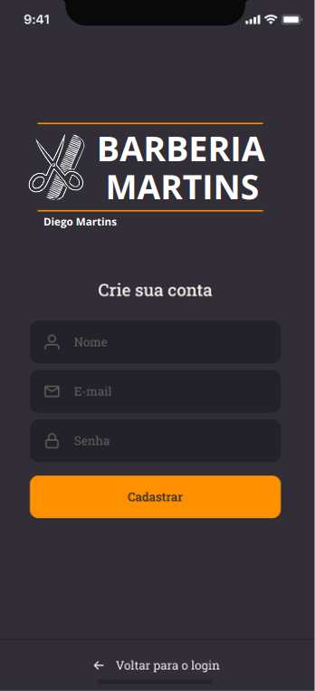
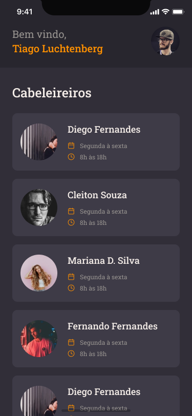
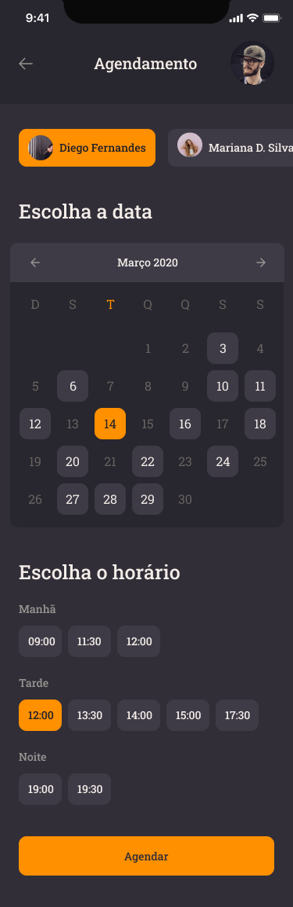

<h1 align="center">
    BarberMartins
</h1>
<br>

## 📝 Sobre o projeto
BarberMartins é um aplicativo para barbearia, onde os barbeiros se cadastram e informam os dias e horários disponíveis para trabalhar, enquanto o cliente se cadastra e escolhe o barbeiro de sua preferência, o dia e horário disponível para cortar seu cabelo.

<br>

<div align="center">





</div>

<br>

## 📱 Mobile
O Mobile foi desenvolvido com React Native e TypeScript. Para padronização e organização do código, foram utilizados ESLint, Prettier e EditorConfig. A estilização foi feita com Styled-Components. As telas de navegação foram feitas com React Navigation. A validação de login e cadastro foi feita com Yup. Para conexão com o Back-End, foi utilizado Axios.

### 🛠 Tecnologias
- **[React Native](https://reactnative.dev/)**
- *[React Navigation](https://reactnavigation.org/)*
- *[Styled-Components](https://styled-components.com/)*
- *[React-Native-Vector-Icons](https://github.com/oblador/react-native-vector-icons)*
- *[Axios](https://nodemon.io/)*
- *[ESLint](https://eslint.org/)*
- *[Prettier](https://prettier.io/)*
- *[EditorConfig](https://editorconfig.org/)*

<br>

## 🏁 Iniciando o projeto Mobile
Clone o projeto

<br>

📱 **Mobile**

````zsh
# para entrar na pasta Mobile
$ cd mobile

# baixar as dependências
$ yarn

# para Android:
$ yarn android

````
<br>

## 🤖 Back-End
O Back-End foi desenvolvido com Node.js e TypeScript, no formato API Rest.
Para padronização e organização do código, foram utilizados ESLint, Prettier e EditorConfig.
A conexão com o banco de dados PostgreSQL foi feita com DBeaver e Docker para criação de containers com TypeORM.
Para autenticação e controle de acesso de usuários, foi utilizado JWT (Json Web Token).
Para upload de imagens, foi utilizado Multer.

### 🛠 Technologies
- **[Node.js](https://nodejs.org/en/)**
- **[TypeScript](https://www.typescriptlang.org/)**
- *[Express](https://expressjs.com/pt-br/)*
- *[Docker](https://www.docker.com/)*
- *[PostgreSQL](https://www.postgresql.org/)*
- *[DBeaver](https://dbeaver.io/)*
- *[TypeORM](https://typeorm.io/#/)*
- *[JWT](https://jwt.io/)*
- *[ESLint](https://eslint.org/)*
- *[Prettier](https://prettier.io/)*
- *[EditorConfig](https://editorconfig.org/)*

<br>

## 🏁 Iniciando o projeto Back-End
Clone o projeto

<br>


🤖 **Back-End**

````zsh
# para entrar na pasta Back-End 
$ cd backend

# baixar as dependências
$ yarn

# iniciar projeto na porta 3333
$ yarn dev:server
````
<br>

---